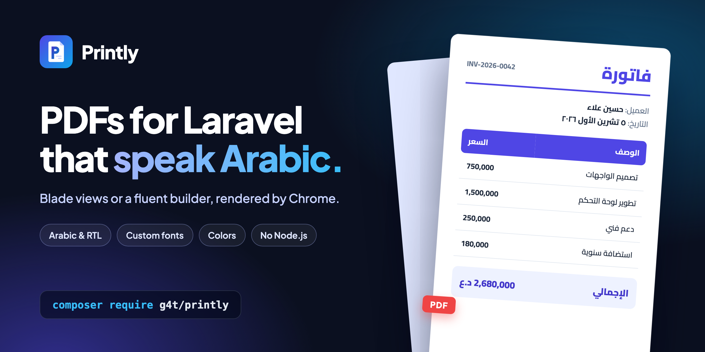

<p align="center">
    
</p>

<h1 align="center">Printly</h1>

<p align="center">
    Generate PDFs in Laravel with headless Chrome, with first-class Arabic and RTL support.
</p>

<p align="center">
    
</p>

Arabic and other right-to-left languages render correctly out of the box (joined letters, right-to-left layout, mixed Arabic/English text), and you can bring your own fonts and colors.

```php
use g4t\Printly\Facades\Printly;

return Printly::view('invoice', ['invoice' => $invoice])
    ->lang('ar')
    ->font('Cairo')
    ->download('فاتورة.pdf');
```

## Contents

- [Features](#features)
- [Requirements](#requirements)
- [Installation](#installation)
- [Quick start](#quick-start)
- [Creating a PDF](#creating-a-pdf)
  - [From a Blade view](#from-a-blade-view)
  - [From an HTML string](#from-an-html-string)
  - [With the builder (no HTML)](#with-the-builder-no-html)
- [Arabic and RTL](#arabic-and-rtl)
- [Fonts](#fonts)
- [Colors](#colors)
- [Page setup](#page-setup)
- [Headers, footers and page numbers](#headers-footers-and-page-numbers)
- [Watermark](#watermark)
- [Output](#output)
- [Builder reference](#builder-reference)
- [Configuration reference](#configuration-reference)
- [Full example: an Arabic invoice](#full-example-an-arabic-invoice)
- [Testing](#testing)
- [Extending](#extending)
- [Errors](#errors)
- [Troubleshooting](#troubleshooting)

## Features

- Two ways to write a PDF: a **Blade view / HTML** for free-form designs, or a **fluent builder** that needs no HTML.
- **Arabic / RTL**: direction is picked automatically from the language, or set by hand.
- **Custom fonts** from `ttf`, `otf`, `woff` and `woff2` files, from a **URL**, or from **Google Fonts**. File and URL fonts are embedded into the PDF.
- **Colors** for text, the page background, headings, tables, callouts and the watermark, in hex, `rgb()`, `hsl()`, CSS names or arrays.
- Paper formats and custom sizes, orientation, margins, scale, page ranges.
- Headers, footers and page numbers on every page; watermarks.
- Save to a path or any filesystem disk, download, show inline, or get the raw bytes.
- `Printly::fake()` for tests, custom drivers, macros, and a `printly:check` command.

## Requirements

- PHP 8.2 or newer
- Laravel 11 or 12
- Chrome or Chromium installed on the machine that renders the PDFs

Node.js is not needed. The package talks to Chrome directly through [chrome-php/chrome](https://github.com/chrome-php/chrome).

Installing Chromium on a Debian server:

```bash
apt-get install -y chromium
```

On Alpine:

```bash
apk add chromium
```

On macOS and Windows a normal Google Chrome installation is detected automatically.

## Installation

```bash
composer require g4t/printly
```

The service provider and the `Printly` facade alias are registered automatically.

Publish the config file (optional):

```bash
php artisan vendor:publish --tag=printly-config
```

Check that everything works. This renders a small Arabic/English sample to `storage/app/printly-check.pdf`:

```bash
php artisan printly:check
```

If Chrome is not found, point to the binary in `.env`. When PHP runs as root (most Docker containers), also turn the sandbox off:

```dotenv
PRINTLY_CHROME_BINARY=/usr/bin/chromium
PRINTLY_CHROME_NO_SANDBOX=true
```

## Quick start

```php
use g4t\Printly\Facades\Printly;

// From a Blade view, downloaded by the browser
Route::get('/invoice/{invoice}', function (Invoice $invoice) {
    return Printly::view('invoices.show', ['invoice' => $invoice])->download('invoice.pdf');
});

// From HTML, saved to disk
Printly::html('<h1>مرحباً بالعالم</h1>')->rtl()->save(storage_path('app/hello.pdf'));

// With the builder, shown in the browser
return Printly::make()
    ->lang('ar')
    ->heading('تقرير المبيعات')
    ->table(['المنتج', 'السعر'], [['قلم', '1,500'], ['دفتر', '2,000']])
    ->inline('report.pdf');
```

Every method returns the PDF object, so calls can be chained in any order. Nothing is rendered until an [output method](#output) is called.

## Creating a PDF

### From a Blade view

```php
Printly::view('invoices.show', ['invoice' => $invoice]);
```

The view can be either of these:

- **A fragment** (just the body markup). The package wraps it in a complete document with the right language, direction, fonts and colors.
- **A complete document** starting with `<html>`. The package adds its styles at the top of your `<head>` (so your own CSS always wins) and adds `dir` and `lang` to the `<html>` tag only if you did not set them.

Everything Chrome can print works: flexbox, grid, gradients, SVG, web fonts, `@page` rules.

Tips for views:

- **Images**: use an absolute file path or a URL.
  ```blade
  
  ```
- **Page breaks**: use standard CSS.
  ```css
  .page-break { break-after: page; }
  tr, .card { break-inside: avoid; }
  ```
- **Table headers** inside `<thead>` repeat on every page automatically.
- **Left-to-right pieces inside Arabic text** (phone numbers, codes) keep their order with:
  ```html
  <span dir="ltr">+964 770 000 0000</span>
  ```

### From an HTML string

```php
Printly::html('<h1>Hello</h1><p>World</p>');
```

The same rules apply as for views: a fragment is wrapped, a complete document is kept as it is.

Add CSS without touching the HTML:

```php
Printly::html($html)->css('h1 { color: #0f766e } p { line-height: 1.8 }');
```

### With the builder (no HTML)

`Printly::make()` builds the document element by element:

```php
Printly::make()
    ->lang('ar')
    ->font('Cairo', 12)
    ->accent('#0f766e')
    ->heading('فاتورة ضريبية')
    ->text('شكراً لتعاملكم معنا.')
    ->details(['رقم الفاتورة' => 'INV-001', 'العميل' => 'حسين علاء'])
    ->table(
        ['المنتج', 'الكمية', 'السعر'],
        [['قلم', 3, '1,500 د.ع'], ['دفتر', 1, '2,000 د.ع']],
    )
    ->callout('الدفع خلال 30 يوماً.')
    ->save(storage_path('app/invoice.pdf'));
```

All text is escaped. See the [builder reference](#builder-reference) for every element and option. The builder has all the page, font, color and output methods described below.

## Arabic and RTL

Chrome shapes Arabic text itself, so letters join correctly and mixed Arabic/English lines are ordered properly. You only choose the direction:

```php
Printly::view('report')->lang('ar');   // RTL languages switch the document to right-to-left
Printly::view('report')->rtl();        // force right-to-left
Printly::view('report')->ltr();        // force left-to-right
Printly::view('report')->direction('rtl');
```

How the direction is decided:

1. `rtl()`, `ltr()` or `direction()` if you called one.
2. Otherwise the `defaults.direction` config value if it is `rtl` or `ltr`.
3. Otherwise (`auto`) the language: right-to-left when it is listed in `rtl_locales` (Arabic, Persian, Urdu, Kurdish Sorani, Hebrew and others).

The language is the one given to `lang()`, or `defaults.lang` from the config, or the application locale. So an application whose locale is `ar` produces right-to-left PDFs with no extra code.

The builder uses logical CSS properties, so the same document flips correctly between RTL and LTR.

On a Linux server with no Arabic fonts installed, text shows as empty boxes. Register a font (next section) and the server needs nothing installed.

## Fonts

There are four sources for a font. The first three are registered under a family name of your choice, then used with `font()` or from your CSS.

### 1. Font files

```php
Printly::view('report')
    ->registerFont('Cairo', [
        'regular' => resource_path('fonts/Cairo-Regular.ttf'),
        'bold' => resource_path('fonts/Cairo-Bold.ttf'),
    ])
    ->font('Cairo');
```

A single file registers the regular weight:

```php
->registerFont('Amiri', resource_path('fonts/Amiri-Regular.ttf'))
```

Supported formats: `ttf`, `otf`, `woff`, `woff2`. The file is embedded into the PDF.

### 2. A URL

Anywhere a file path is accepted, an `http(s)` link to the font file works too:

```php
Printly::view('report')
    ->registerFont('Cairo', [
        'variable' => 'https://raw.githubusercontent.com/google/fonts/main/ofl/cairo/Cairo%5Bslnt%2Cwght%5D.ttf',
    ])
    ->font('Cairo');
```

- The font is downloaded the first time a PDF uses it and cached in `font_cache_path` (`storage/framework/cache/printly-fonts`). Later renders do not touch the network.
- It is embedded like a local file, so it also works in headers and footers.
- The link must return the font file itself. The type is detected from the file contents, so the URL does not need an extension.
- To download a font again, delete its file from the cache directory.

### 3. Google Fonts

```php
Printly::view('report')
    ->googleFont('Tajawal', [400, 700])   // weights, default [400, 700]
    ->font('Tajawal');
```

Chrome fetches the font while rendering, so the server needs network access every time. Google Fonts cannot be used in headers and footers; use a file or URL font there.

### 4. System fonts

`font()` accepts any font installed on the machine that runs Chrome, with no registration:

```php
Printly::view('report')->font('Tahoma');
```

### Variants

The keys of the array say which weight and style each file is:

| Key | Meaning |
| --- | --- |
| `regular` (or `normal`) | weight 400 |
| `bold` | weight 700 |
| `italic` | weight 400, italic |
| `bold_italic` | weight 700, italic |
| `thin`, `extralight`, `light`, `medium`, `semibold`, `extrabold`, `black` | weights 100, 200, 300, 500, 600, 800, 900 |
| `300`, `'300italic'` | any weight from 100 to 900, optionally italic |
| `variable` | a variable font covering weights 100 to 900 |

### Registering fonts for every PDF

In `config/printly.php`:

```php
'fonts' => [
    'Cairo' => [
        'regular' => resource_path('fonts/Cairo-Regular.ttf'),
        'bold' => resource_path('fonts/Cairo-Bold.ttf'),
    ],
    'Amiri' => 'https://example.com/fonts/Amiri-Regular.ttf',
],

'google_fonts' => ['Tajawal' => [400, 700]],

'defaults' => [
    'font' => 'Cairo',
],
```

Or at runtime, for example in a service provider:

```php
Printly::registerFont('Cairo', resource_path('fonts/Cairo-Regular.ttf'));
Printly::googleFont('Tajawal');
```

`Printly::registerFont()` on the facade is global. `->registerFont()` on a PDF applies to that PDF only.

### Using fonts

```php
->font('Cairo')          // default font of the document
->font('Cairo', 12)      // with a base size in points
->fontSize('11pt')       // base size only
```

Registered families can also be used from your own CSS:

```css
h1 { font-family: 'Amiri'; }
```

Only the fonts a document actually refers to (the default font, or a family named in the HTML or CSS) are sent to Chrome, so registering many fonts in the config costs nothing.

After the document font, the families in `fallback_fonts` are tried in order.

## Colors

Every color argument accepts:

| Form | Example |
| --- | --- |
| Hex, with or without `#` | `'#1a73e8'`, `'1a73e8'`, `'#fff'`, `'#1a73e880'` |
| `rgb()` / `rgba()` | `'rgb(26, 115, 232)'`, `'rgba(0, 0, 0, .5)'` |
| `hsl()` / `hsla()` | `'hsl(210, 50%, 40%)'` |
| CSS color name | `'tomato'`, `'white'`, `'transparent'` |
| Array | `[26, 115, 232]`, `[26, 115, 232, 0.5]` |

Anything else throws `g4t\Printly\Exceptions\InvalidColor`.

```php
Printly::view('report')
    ->color('#1f2937')          // default text color
    ->background('#fffbeb');    // page background, edge to edge including the margins
```

Colors and backgrounds in your own CSS are always printed; there is nothing to enable.

In the builder, `accent()` sets the color of headings, table headers and callout borders, and most elements take their own color arguments:

```php
Printly::make()
    ->accent('#0f766e')
    ->heading('عنوان', color: '#7c3aed')
    ->text('نص ملون', color: '#b91c1c', background: '#fef2f2')
    ->table($headers, $rows, headerBackground: '#111827', headerColor: '#fff', striped: '#f9fafb', borderColor: '#d1d5db')
    ->callout('ملاحظة', background: '#ecfdf5', color: '#065f46', borderColor: '#059669')
    ->divider('#e5e7eb');
```

## Page setup

```php
Printly::view('report')
    ->format('A4')
    ->landscape()
    ->margins(15)
    ->title('تقرير المبيعات');
```

**Paper format**: `A3`, `A4` (default), `A5`, `A6`, `Letter`, `Legal`, `Tabloid`.

**Custom size**, for example a thermal receipt:

```php
->paperSize(80, 200)          // width, height in millimetres
->paperSize('3in', '8in')
```

**Orientation**: `->landscape()`, `->portrait()` or `->orientation('landscape')`.

**Margins** follow the CSS shorthand:

```php
->margins(15)                 // all sides
->margins(10, 20)             // top and bottom, left and right
->margins(10, 20, 30)         // top, left and right, bottom
->margins(10, 20, 30, 40)     // top, right, bottom, left
->margins('1in', '2cm')
```

**Units**: a bare number is millimetres. Strings can use `mm`, `cm`, `in`, `pt` or `px`. Font sizes are the exception: a bare number is points.

**Title**: `->title('...')` sets the document title shown by PDF readers.

**Scale**: `->scale(0.9)` shrinks or enlarges the content (0.1 to 2).

**Page ranges**: `->pages('1-3, 5')` keeps only some pages.

**Extra CSS**: `->css('...')` is added after the package styles. It can be called several times.

A size set in your own CSS with `@page { size: ... }` takes priority over `format()`.

## Headers, footers and page numbers

```php
Printly::view('report')
    ->header('<b>شركة المثال</b> — {title}')
    ->footer('صفحة {page} من {pages} — {date}');
```

Or just page numbers:

```php
->pageNumbers()                              // "1 / 5"
->pageNumbers('صفحة {page} من {pages}')
```

Placeholders:

| Placeholder | Replaced with |
| --- | --- |
| `{page}` | current page number |
| `{pages}` | total number of pages |
| `{date}` | print date |
| `{title}` | document title |

Things to know:

- They are drawn **inside the top and bottom margins**. Keep those margins large enough (about 15 mm or more), or the text is cut off.
- They are centered, 9pt, and follow the document's font and direction. The text is gray unless you set a document color with `color()`. Style them with inline styles:
  ```php
  ->footer('<div style="text-align:left; color:#0f766e; font-size:8pt">{page}</div>')
  ```
- Chrome renders them separately from the page, so your page CSS and `->css()` do not apply to them.
- Fonts registered from files or URLs work. Google Fonts do not.
- `header()` and `footer()` take HTML and do not escape it. `pageNumbers()` takes text and escapes it.

## Watermark

```php
->watermark('مسودة')
->watermark('CONFIDENTIAL', color: '#dc2626', opacity: 0.1, angle: -45, size: 80)
```

| Argument | Default | Meaning |
| --- | --- | --- |
| `text` | | the watermark text |
| `color` | `#000000` | any [color](#colors) |
| `opacity` | `0.08` | 0 to 1 |
| `angle` | `-35` | rotation in degrees |
| `size` | `90` | font size in points |

The watermark repeats on every page.

## Output

```php
$pdf = Printly::view('invoice', $data);

$pdf->save(storage_path('app/invoices/1.pdf'));   // local path, directories are created
$pdf->save('invoices/1.pdf', 's3');               // any filesystem disk

return $pdf->download('invoice.pdf');             // response that downloads the file
return $pdf->inline('invoice.pdf');               // response that opens in the browser
return $pdf;                                      // same as inline()

$bytes = $pdf->content();                         // raw PDF bytes
$base64 = $pdf->base64();                         // for APIs and email attachments
$html = $pdf->toHtml();                           // the HTML sent to Chrome, for debugging
```

- File names can be Arabic: `->download('فاتورة.pdf')`. The `.pdf` extension is added if missing.
- `save()` returns the PDF object, so it can be chained: `->save($path)->save($path, 's3')`.
- Each output call renders the PDF again. To use one PDF several times, call `content()` once and reuse the bytes.

Attaching to an email:

```php
use Illuminate\Mail\Mailables\Attachment;

public function attachments(): array
{
    return [
        Attachment::fromData(fn () => Printly::view('invoice', $this->data)->content(), 'invoice.pdf')
            ->withMime('application/pdf'),
    ];
}
```

Every render starts Chrome, which takes a couple of seconds. For large or frequent PDFs, generate them in a queued job and `save()` the result.

## Builder reference

Start with `Printly::make()`. Text arguments are escaped; pass an `Illuminate\Support\HtmlString` to output HTML.

### `accent($color)`

Color of headings, table headers and callout borders. Default `#2563eb`.

### `heading($text, $level = 1, $color = null, $align = null)`

```php
->heading('العنوان الرئيسي')
->heading('عنوان فرعي', level: 2, color: '#7c3aed', align: 'center')
```

`level` is 1 to 6. `align` is `start`, `end`, `left`, `right`, `center` or `justify`.

### `text($text, $color = null, $size = null, $align = null, $bold = false, $background = null)`

A paragraph. Line breaks in the text are kept. A bare-number `size` is points.

```php
->text('فقرة عادية')
->text("سطر أول\nسطر ثاني", color: '#b91c1c', size: 14, align: 'center', bold: true)
```

### `list($items, $ordered = false, $color = null)`

```php
->list(['عنصر أول', 'عنصر ثاني'])
->list(['الخطوة الأولى', 'الخطوة الثانية'], ordered: true)
```

### `table($headers, $rows, $headerBackground = null, $headerColor = null, $striped = true, $borderColor = null)`

```php
->table(
    ['المنتج', 'الكمية', 'السعر'],
    [
        ['قلم', 3, '1,500 د.ع'],
        ['دفتر', 1, '2,000 د.ع'],
    ],
    headerBackground: '#0f766e',
    headerColor: 'white',
    striped: '#f0fdfa',        // true (default gray), false, or a color
    borderColor: '#99f6e4',
)
```

Rows can be any iterable of arrays, including collections and associative arrays. The header row repeats on every page the table spans, and rows are never split across pages. Pass `[]` as headers for a table without a header.

### `details($pairs)`

A two-column label/value table:

```php
->details([
    'رقم الفاتورة' => 'INV-001',
    'العميل' => 'حسين علاء',
    'التاريخ' => '2026-10-05',
])
```

### `image($source, $width = null, $height = null, $align = null)`

```php
->image(public_path('logo.png'), width: 40, align: 'center')
->image('https://example.com/logo.png', height: '2cm')
```

`source` is a local file (`png`, `jpg`, `gif`, `webp`, `svg`; embedded into the PDF), a URL or a data URI. Bare-number dimensions are millimetres.

### `callout($text, $background = null, $color = null, $borderColor = null)`

A highlighted box for notes and totals.

```php
->callout('الدفع خلال 30 يوماً.', background: '#ecfdf5', borderColor: '#059669')
```

### `divider($color = null)`, `space($height = 5)`, `pageBreak()`

```php
->divider()            // horizontal line
->space(10)            // vertical gap, millimetres
->pageBreak()          // continue on a new page
```

### `raw($html)`

Unescaped HTML for anything the builder does not cover:

```php
->raw('<div style="display:flex; gap:10mm">...</div>')
->raw(view('partials.signature', $data))
```

### Restyling

Builder elements live inside `.pdf-doc` and can be restyled with `css()`:

```php
->css('.pdf-doc h1 { border-bottom: 2px solid #0f766e } .pdf-doc td { padding: 3mm }')
```

## Configuration reference

`config/printly.php` after publishing:

| Key | Default | Meaning |
| --- | --- | --- |
| `driver` | `chrome` | The rendering driver. Env: `PRINTLY_DRIVER`. |
| `chrome.binary` | `null` | Path to Chrome/Chromium. `null` detects it automatically (also reads the `CHROME_PATH` environment variable). Env: `PRINTLY_CHROME_BINARY`. |
| `chrome.no_sandbox` | `false` | Start Chrome without its sandbox. Needed when running as root, as in most Docker containers. Env: `PRINTLY_CHROME_NO_SANDBOX`. |
| `chrome.timeout` | `30` | Seconds to wait for Chrome to start, load the page and print it. Env: `PRINTLY_CHROME_TIMEOUT`. |
| `chrome.flags` | `[]` | Extra Chrome command line flags, such as `['--disable-gpu']`. |
| `chrome.temp_path` | `null` | Directory for the temporary HTML file. `null` uses the system temp directory. |
| `defaults.format` | `A4` | Paper format. |
| `defaults.orientation` | `portrait` | `portrait` or `landscape`. |
| `defaults.margins` | `15` | A number, or `[top, right, bottom, left]`. |
| `defaults.direction` | `auto` | `auto` (from the language), `rtl` or `ltr`. |
| `defaults.lang` | `null` | Document language. `null` uses the application locale. |
| `defaults.font` | `null` | Default font family. |
| `defaults.font_size` | `null` | Base font size, such as `12` or `'11pt'`. |
| `defaults.color` | `null` | Default text color. |
| `defaults.background` | `null` | Page background color. |
| `fallback_fonts` | `['Tahoma', 'Arial', 'sans-serif']` | Fonts tried after the document font. |
| `rtl_locales` | `['ar', 'ckb', 'dv', 'fa', 'he', 'ps', 'sd', 'ug', 'ur', 'yi']` | Languages that make `auto` direction right-to-left. |
| `fonts` | `[]` | Fonts available to every PDF. See [Fonts](#fonts). |
| `font_cache_path` | `storage/framework/cache/printly-fonts` | Where fonts registered by URL are cached. |
| `font_download_timeout` | `15` | Seconds to wait when downloading a font from a URL. |
| `google_fonts` | `[]` | Google Fonts families available to every PDF. |

Every default can be overridden per PDF with the matching method.

## Full example: an Arabic invoice

`app/Http/Controllers/InvoiceController.php`

```php
namespace App\Http\Controllers;

use App\Models\Invoice;
use g4t\Printly\Facades\Printly;

class InvoiceController extends Controller
{
    public function download(Invoice $invoice)
    {
        return Printly::view('invoices.pdf', ['invoice' => $invoice->load('items', 'customer')])
            ->lang('ar')
            ->registerFont('Cairo', [
                'variable' => 'https://raw.githubusercontent.com/google/fonts/main/ofl/cairo/Cairo%5Bslnt%2Cwght%5D.ttf',
            ])
            ->font('Cairo', 11)
            ->format('A4')
            ->margins(14, 14, 18)
            ->title('فاتورة '.$invoice->number)
            ->pageNumbers('صفحة {page} من {pages}')
            ->download('فاتورة-'.$invoice->number.'.pdf');
    }
}
```

`resources/views/invoices/pdf.blade.php`

```blade
<style>
    h1 { color: #0f766e; margin: 0 0 6mm; }
    table { width: 100%; border-collapse: collapse; }
    th { background: #0f766e; color: #fff; padding: 3mm; text-align: start; }
    td { padding: 3mm; border-bottom: 1px solid #e5e7eb; }
    tr { break-inside: avoid; }
    .total { margin-top: 6mm; font-size: 14pt; font-weight: 700; text-align: end; }
</style>

<h1>فاتورة رقم <span dir="ltr">{{ $invoice->number }}</span></h1>
<p>العميل: {{ $invoice->customer->name }}</p>

<table>
    <thead>
        <tr><th>الوصف</th><th>الكمية</th><th>السعر</th></tr>
    </thead>
    <tbody>
        @foreach ($invoice->items as $item)
            <tr>
                <td>{{ $item->name }}</td>
                <td>{{ $item->quantity }}</td>
                <td>{{ number_format($item->price) }} د.ع</td>
            </tr>
        @endforeach
    </tbody>
</table>

<div class="total">الإجمالي: {{ number_format($invoice->total) }} د.ع</div>
```

## Testing

`Printly::fake()` replaces Chrome with a fake that records what would have been rendered:

```php
use g4t\Printly\Facades\Printly;
use g4t\Printly\RenderOptions;

public function test_invoice_pdf(): void
{
    $fake = Printly::fake();

    $this->get('/invoices/1/pdf')
        ->assertOk()
        ->assertHeader('Content-Type', 'application/pdf');

    $fake->assertRenderedCount(1)
        ->assertSee('فاتورة ضريبية')
        ->assertRendered(fn (string $html, RenderOptions $options) => ! $options->landscape);
}
```

| Method | Asserts |
| --- | --- |
| `assertRendered()` | at least one PDF was rendered |
| `assertRendered(fn ($html, $options) => ...)` | a rendered PDF matches the callback |
| `assertRenderedCount($n)` | exactly `$n` PDFs were rendered |
| `assertNothingRendered()` | no PDF was rendered |
| `assertSee($text)` | a rendered PDF contains the text |
| `rendered()` | returns the recorded renders as `['html' => ..., 'options' => ...]` |

Fonts registered by URL are downloaded with Laravel's HTTP client, so `Http::fake()` covers them.

## Extending

### Conditional calls

```php
Printly::view('report')
    ->when($user->prefersArabic(), fn ($pdf) => $pdf->lang('ar'))
    ->when($draft, fn ($pdf) => $pdf->watermark('مسودة'));
```

### Macros

Add your own methods to `g4t\Printly\Pdf` (the PDF object, not the facade), for example a company letterhead:

```php
\g4t\Printly\Pdf::macro('letterhead', function () {
    return $this
        ->font('Cairo')
        ->header('<b>شركة المثال</b>')
        ->pageNumbers('صفحة {page} من {pages}');
});
```

```php
Printly::view('report')->letterhead()->download();
```

### Custom drivers

Implement `g4t\Printly\Contracts\Driver`:

```php
use g4t\Printly\Contracts\Driver;
use g4t\Printly\RenderOptions;

class GotenbergDriver implements Driver
{
    public function render(string $html, RenderOptions $options): string
    {
        // return the raw PDF bytes
    }
}
```

Register it in a service provider and select it in the config:

```php
Printly::extend('gotenberg', fn ($app, array $config) => new GotenbergDriver);
```

```php
// config/printly.php
'driver' => 'gotenberg',
```

`RenderOptions` carries the paper size and margins (all in inches), orientation, header and footer HTML, scale and page ranges.

## Errors

| Exception | When |
| --- | --- |
| `g4t\Printly\Exceptions\InvalidColor` | a color value is not valid |
| `g4t\Printly\Exceptions\InvalidFont` | a font file is missing, has an unsupported format, or the family name or variant is invalid |
| `g4t\Printly\Exceptions\FontDownloadFailed` | a font URL cannot be downloaded or does not return a font file |
| `g4t\Printly\Exceptions\RenderingFailed` | Chrome cannot be started or fails to print |
| `InvalidArgumentException` | an unknown paper format, alignment, length or direction |

## Troubleshooting

**"Could not start Chrome"**
Chrome is not installed or not found. Install it and set `PRINTLY_CHROME_BINARY`. In Docker or when running as root, set `PRINTLY_CHROME_NO_SANDBOX=true`.

**Arabic shows as empty boxes**
The server has no Arabic font. Register one from a file or URL and select it with `font()` or `defaults.font`.

**My font is not applied**
The family name in `font()` or in your CSS must match the registered name. A font that is registered but never referred to is not loaded.

**The header or footer is missing or cut off**
The top or bottom margin is too small. Use at least `->margins(15)`.

**The font in the header or footer is wrong**
Google Fonts are not available there. Register the font from a file or URL.

**Images do not appear**
Use an absolute file path (`public_path('logo.png')`) or a full URL that the server can reach, not a relative path.

**"Could not download font"**
The link must return the font file itself (`ttf`, `otf`, `woff`, `woff2`), not a CSS or HTML page. For a Google Fonts family use `googleFont()`.

**Rendering times out**
Raise `PRINTLY_CHROME_TIMEOUT`. Pages that load slow remote images or fonts are the usual cause.

## License

MIT
# printly-pdf
